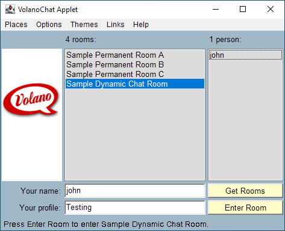
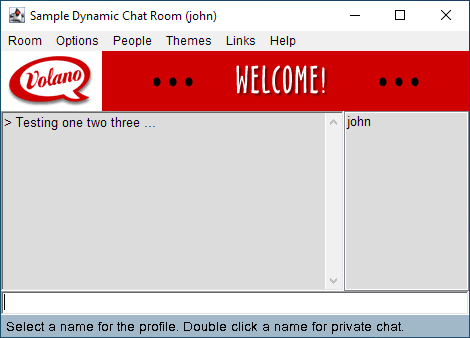

This repository contains the source code of the *VOLANO™* chat server, a formerly proprietary software package that is now available as free and open source software under the [GNU General Public License v3.0](LICENSE).

The *VOLANO* chat server is a cross-platform console application written in Java with clients that run in the Web browser as Java applets. The software was written by John Neffenger, the owner of this repository, with later contributions by Graham Savage and Paul Jack. *VOLANO* version 1.0 was released on June 18, 1996, and in the years that followed, the software was licensed to customers in 50 countries around the world. Customers used the *VOLANO* chat server to provide chat rooms for visitors to their Web sites.

### Goals

My goals for this project are to update the software as follows:

- Switch the build automation from Apache Ant and GNU Make to [Gradle](https://docs.gradle.org/current/userguide/multi_project_builds.html).

- Refactor the *VOLANO* chat server for the latest [Java Development Kit](https://jdk.java.net/) (JDK).

- Develop a new client for the [modern Web](https://developer.mozilla.org/en-US/docs/Web/API/Websockets_API) to replace the existing Java applets.

- Provide the *VOLANO* chat server for Linux as a self-contained app in the [Snap Store](https://snapcraft.io/store).

- Create a Web-based administrator interface for managing the *VOLANO* chat server.

This is a relatively large project, and I have a lot to learn. The initial commit contains 20,100 lines of Java source code. The time-frame for completing all of these goals, therefore, is likely closer to a few years rather than a few weeks. Please note that I may modify or abandon some of the goals based on my availability and changes to the software ecosystem.

### Status

I expect to make comprehensive changes as I bring the project up to date with current Java code practices, build automation tools, and software packaging techniques. During that time, entire sections of the code may be rewritten, moved, or deleted. I plan to accept issue reports and pull requests once the source code is stable enough to allow for collaboration.

I will post build instructions and information on running and debugging the software after I have converted the build automation to Gradle.

### Screenshots

The client side runs using the *appletviewer* command available in versions of the Java Development Kit prior to version 11. The main applet window displays a list of chat rooms as seen in the screenshot below.



The *Enter Room* button opens another window, shown below, for sending and receiving messages in the chat room. At the top of the window is a banner area which can display either a series of static images or another interactive Java applet embedded in this one.



The server side can run as an automatic background service, or it can be started from the command line as a console application as shown by the Bash session below.

```console
john@ubuntu:~/opt/volano-2.13$ ./startup.sh
openjdk version "1.8.0_242"
OpenJDK Runtime Environment (build 1.8.0_242-8u242-b08-0ubuntu3~16.04-b08)
OpenJDK 64-Bit Server VM (build 25.242-b08, mixed mode)
VOLANO(TM) Chat Server Version 2.13.4
Copyright (C) 1996-2015 John Neffenger
Loading server properties from "/home/john/opt/volano-2.13/conf/properties.txt".
ubuntu:8000 (192.168.1.2:8000) VolanoChatPro - unlimited connections.
Apache Tomcat/4.1.40
```
